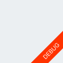
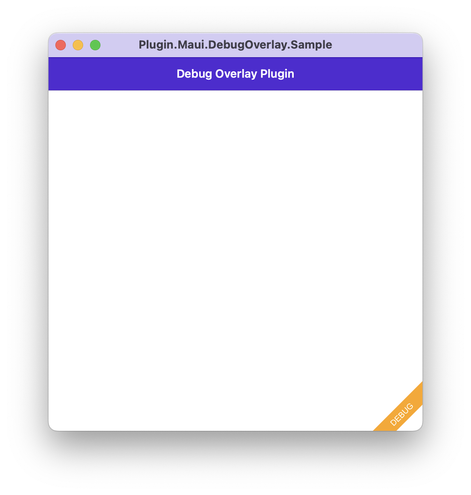

# Plugin.Maui.DebugOverlay

`Plugin.Maui.DebugOverlay` provides a simple ribbon to indicate the app is running in Debug mode.



## Install Plugin

[](https://www.nuget.org/packages/Plugin.Maui.DebugOverlay/)

Available on [NuGet](http://www.nuget.org/packages/Plugin.Maui.DebugOverlay).

Install with the dotnet CLI: `dotnet add package Plugin.Maui.DebugOverlay`, or through the NuGet Package Manager in Visual Studio.

### Supported Platforms

| Platform | Minimum Version Supported |
|----------|---------------------------|
| iOS      | 11+                       |
| macOS    | 10.15+                    |
| Android  | 5.0 (API 21)              |
| Windows  | 11 and 10 version 1809+   |

## Usage

Enable the plugin in your `MauiProgram.cs` and provide your preferred color.

```csharp
.UseDebugRibbon(Colors.Orange)
```

For exmaple:

```csharp
public static MauiApp CreateMauiApp()
	{
		var builder = MauiApp.CreateBuilder();
		builder
			.UseMauiApp<App>()
			.UseDebugRibbon(Colors.Orange)
			.ConfigureFonts(fonts =>
			{
				fonts.AddFont("OpenSans-Regular.ttf", "OpenSansRegular");
				fonts.AddFont("OpenSans-Semibold.ttf", "OpenSansSemibold");
			});

		builder.Services.AddTransient<MainPage>();

		return builder.Build();
	}
``` 

It will only display in Debug. 

